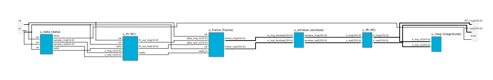

## OVERVIEW
This project is an implementation of a real-time DSP pipeline using an FPGA. It consists of an input signal, a filtering stage using a 16-tap FIR filter, a Hamming window, a 16-point FFT using the Radix-2 Decimation in Frequency algorithm and a magnitude squared computation. All operations are done in Q1.15 format.

## FIR Filter
The FIR (Finite Impulse Response) filter is the first stage in the pipeline. It is a 16-tap filter with coefficients hard-coded into the design. The coefficients for the filter are symmetric, which is a characteristic of linear phase filters. The output of the filter is calculated as a weighted sum of the current and past 15 samples of the input. Each output sample is calculated independently for the real and imaginary components of the input. Thus, for each clock cycle with valid input data, there is a corresponding output sample.

## Hamming Window
Before the FFT is computed, a Hamming window is applied to the 16 collected samples. The Hamming window coefficients are hardcoded in Q1.15 format.

## FFT
The FFT stage consists of calculating the Discrete Fourier Transform of a sequence of 16 filtered samples using the Radix-2 Decimation in Frequency algorithm.  Each butterfly takes two complex numbers as input, applies a twiddle factor, and produces two complex output numbers. The FFT has 4 stages of butterflies to calculate the 16-point DFT, with twiddle factors precomputed and stored in Q1.15 format.

## Magnitude Squared
After the FFT, the magnitude squared is computed for each of the 16 frequency bins. Rather than computing the true magnitude (which requires a square root), the magnitude squared is used.

# 

## Planned
- Threshold (CFAR)
- Peak Detector
